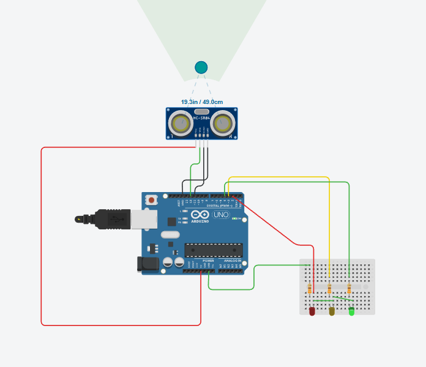
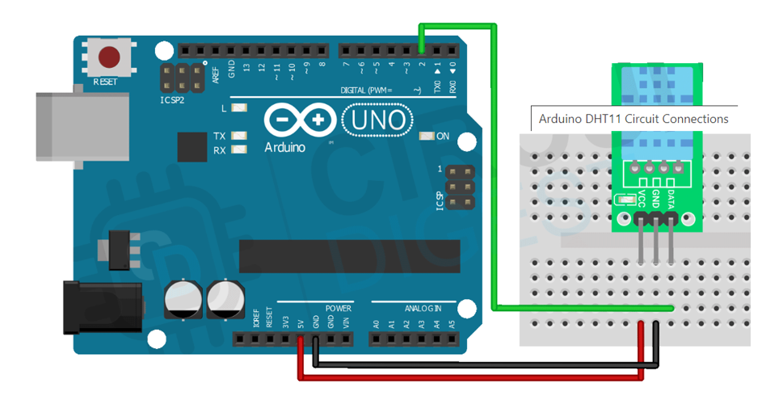

#  IOT Projects

A collection of simple and intermediate-level **Arduino-based IoT projects**, each demonstrating sensors, displays, and interactive hardware..

---

##  Project Index  
1. [Traffic Density Controller](#1---traffic-density-controller)  
2. [Emotion Display Mask (Robot Face Expressions)](#2---emotion-display-mask-robot-face-expressions)  
3. [DHT11 Temperature & Humidity Monitor](#3---DHT11-temperature-and-humidity-monitor)

---

#  1 - Traffic Density Controller

 Arduino project that uses an **HC-SR04 ultrasonic sensor** to detect vehicle distance and control **Red, Yellow, and Green LEDs** like a smart traffic light.

---

###  Overview
Distance from the HC-SR04 sensor determines traffic density:

| Distance | LED | Meaning |
|---------|-----|---------|
| > 50 cm | 🟢 Green | Road Clear |
| 20–50 cm | 🟡 Yellow | Moderate Traffic |
| < 20 cm | 🔴 Red | Heavy Traffic |

---

###  Features
- Real-time traffic sensing  
- LED-based visual output  
- Easy to build & simulate (Tinkercad)  
- Useful for mini-projects and demonstrations  

---

###  Hardware Components
- Arduino Uno  
- HC-SR04 Ultrasonic Sensor  
- LEDs (Red, Yellow, Green)  
- Resistors (220Ω)  
---

###  Circuit Connections

```
┌────────────────────────────────────────────┐
│           HC-SR04 Ultrasonic Sensor        │
├────────────────────────────────────────────┤
│ TRIG  → Pin 9                              │
│ ECHO → Pin 10                              │
│ VCC   → 5V                                 │
│ GND   → GND                                │
└────────────────────────────────────────────┘

┌────────────────────────────────────────────┐
│                 LED Indicators              │
├────────────────────────────────────────────┤
│ Red LED    → Pin 2 → 220Ω → GND            │
│ Yellow LED → Pin 3 → 220Ω → GND            │
│ Green LED  → Pin 4 → 220Ω → GND            │
└────────────────────────────────────────────┘
```



---

###  How It Works
1. HC-SR04 emits an ultrasonic pulse.  
2. Arduino calculates distance using echo time.  
3. LEDs change according to preset traffic thresholds.  

---

#  2 - Emotion Display Mask (Robot Face Expressions)

A fun project that displays **robot facial expressions** on an OLED screen.  
Expressions change using a button or touch sensor, with **RGB LED** color and **buzzer feedback**.

---

###  Overview
Robot expressions included:
- 😀 Happy  
- 😡 Angry  
- 😮 Surprised  
- 😐 Neutral  

Brightness can be adjusted using a potentiometer.

---

###  Features
- OLED graphical emotion display  
- Touch/button-based interaction  
- RGB LED mood colors  
- Buzzer sound effects  
- Adjustable screen brightness  

---

###  Hardware Components
- Arduino Uno  
- SSD1306 OLED Display  
- Pushbutton or TTP223 Touch Sensor  
- RGB LED (Common Cathode)  
- Buzzer  
- 10kΩ Potentiometer  
---

###  Circuit Connections

```
┌────────────────────────────────────────────┐
│               OLED Display (SSD1306)       │
├────────────────────────────────────────────┤
│ VCC → 5V                                   │
│ GND → GND                                  │
│ SDA → A4                                   │
│ SCL → A5                                   │
└────────────────────────────────────────────┘

┌────────────────────────────────────────────┐
│          Button / Touch Sensor (TTP223)    │
├────────────────────────────────────────────┤
│ OUT → Pin 2                                │
│ GND → GND                                  │
└────────────────────────────────────────────┘

┌────────────────────────────────────────────┐
│                RGB LED (Common Cathode)    │
├────────────────────────────────────────────┤
│ Red   → Pin 3                              │
│ Green → Pin 5                              │
│ Blue  → Pin 6                              │
│ GND (Common) → GND                         │
└────────────────────────────────────────────┘

┌────────────────────────────────────────────┐
│                    Buzzer                  │
├────────────────────────────────────────────┤
│ + → Pin 8                                  │
│ – → GND                                    │
└────────────────────────────────────────────┘

┌────────────────────────────────────────────┐
│                Potentiometer (10kΩ)        │
├────────────────────────────────────────────┤
│ Left  → 5V                                 │
│ Right → GND                                │
│ Middle → A0                                │
└────────────────────────────────────────────┘
```


---

###  How It Works
1. OLED displays the current facial expression.  
2. Button/touch sensor triggers the next expression.  
3. RGB LED color changes to match the emotion.  
4. Buzzer produces a short beep as feedback.  
5. Potentiometer adjusts display brightness.  

---

#  3 - DHT11 Temperature & Humidity Monitor

A simple project that reads **temperature and humidity** using the DHT11 digital sensor and displays it via Serial Monitor or OLED.

---

###  Features
- Temperature in °C  
- Humidity (%)  
- Fast digital communication  
- Beginner-friendly project  

---

###  Hardware Components
- Arduino Uno  
- DHT11 Sensor Module  
---

### Circuit Connections

```
┌────────────────────────────────────────────┐
│               DHT11 Sensor Module          │
├────────────────────────────────────────────┤
│ VCC  → 5V                                  │
│ GND  → GND                                 │
│ DATA → Pin 7                               │
└────────────────────────────────────────────┘
```



---

### ⚙️ How It Works
1. Arduino requests data from DHT11.  
2. Sensor returns humidity + temperature.  
3. Values are displayed in Serial Monitor or OLED.  

---
